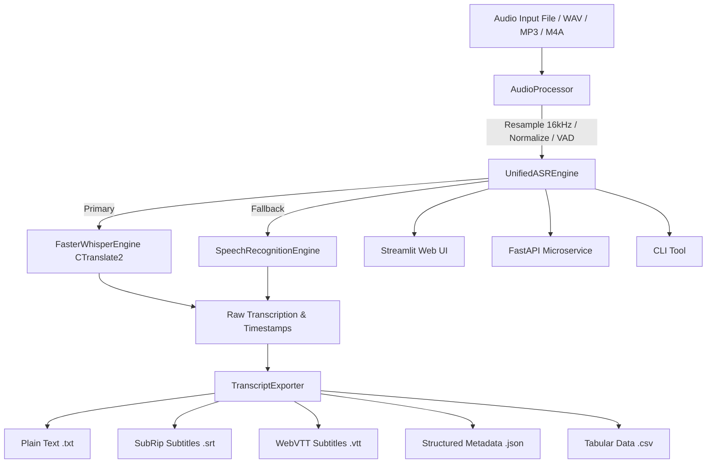

# 🎙️ Automatic Speech Recognition (ASR) Tool

[](https://www.python.org/)
[](LICENSE)
[](https://github.com/openai/whisper)
[](tests/)

A high-performance, production-ready **Automatic Speech Recognition (ASR) Tool** powered by OpenAI's Whisper model architecture (via CTranslate2 optimized `faster-whisper`), fallback engines, and audio processing tools.

This repository provides an end-to-end speech recognition solution featuring an interactive **Web UI (Streamlit)**, **REST API Microservice (FastAPI)**, and a **Command Line Interface (CLI)** with support for multi-lingual transcription, translation to English, Voice Activity Detection (VAD), and subtitle generation (.SRT, .VTT, .JSON, .TXT, .CSV).

---

## 🌟 Key Features

- **Multi-Engine Speech Recognition**: Powered by CTranslate2 optimized `faster-whisper` for fast inference on CPU/GPU, with automatic fallback to standard speech recognition pipelines.
- **Multi-Lingual Transcription & Translation**: Supports automatic language detection across 90+ languages, or translate non-English speech directly to English.
- **Subtitle & Caption Generation**: Export transcription with precise word/segment timestamps into `.SRT`, `.VTT`, `.JSON`, `.TXT`, and `.CSV` formats.
- **Voice Activity Detection (VAD)**: Built-in Silero VAD filtering to strip background noise and silent frames, speeding up transcription.
- **Interactive Web Interface (Streamlit)**: Upload audio files, record live voice from microphone in real-time, preview signal waveforms, view segment timing breakdown, and download subtitles with one click.
- **REST API Microservice (FastAPI)**: Production-ready API endpoints (`/transcribe`, `/transcribe/export`, `/models`, `/health`) with automatic OpenAPI documentation (`/docs`).
- **Feature-Rich CLI**: Command-line tool for single file and batch directory transcription processing.
- **Audio Preprocessor & Signal Analyzer**: Normalization, mono conversion, 16kHz resampling, and audio metric computation (RMS, peak amplitude, duration).
- **Synthetic Speech Generator**: Includes test audio wave synthesizer for automated benchmarks without requiring pre-recorded files.

---

## 🛠️ Tools & Technologies Used

| Category | Technology / Library | Purpose |
| :--- | :--- | :--- |
| **Core Model** | [Faster-Whisper](https://github.com/SYSTRAN/faster-whisper) (CTranslate2) | High-speed transformer-based speech recognition & translation |
| **Deep Learning** | [PyTorch](https://pytorch.org/) | Tensor runtime and model execution engine |
| **Audio Processing** | [SoundFile](https://python-soundfile.readthedocs.io/), [SciPy](https://scipy.org/), `wave` | Audio IO, resampling to 16kHz PCM, signal normalization |
| **Fallback Engine** | [SpeechRecognition](https://pypi.org/project/SpeechRecognition/) | Lightweight secondary speech engine |
| **Web Dashboard** | [Streamlit](https://streamlit.io/) | Modern browser UI with live audio player & subtitle downloads |
| **REST API** | [FastAPI](https://fastapi.tiangolo.com/), [Uvicorn](https://www.uvicorn.org/) | High-performance asynchronous web endpoints |
| **Testing** | [PyTest](https://docs.pytest.org/), `httpx` | Unit & integration test suite (20 tests passed) |

---

## 📐 System Architecture



---

## 📂 Project Structure

```
ASR implementation/
├── asr_tool/                  # Core ASR Python Package
│   ├── __init__.py            # Package initialization & exports
│   ├── config.py              # Configuration dataclasses & Enums
│   ├── audio_processor.py     # Signal loading, resampling, stats & synthesis
│   ├── engine.py              # Faster-Whisper & fallback engine implementations
│   ├── exporters.py           # TXT, SRT, VTT, JSON, CSV exporters
│   ├── cli.py                 # Command-line interface parser & handlers
│   └── api.py                 # FastAPI REST API endpoints
├── tests/                     # Unit & Integration Test Suite
│   ├── __init__.py
│   ├── test_audio_processor.py
│   ├── test_engine.py
│   ├── test_exporters.py
│   ├── test_cli.py
│   └── test_api.py
├── app.py                     # Streamlit Web Application Dashboard
├── generate_sample_audio.py   # Synthetic speech audio generator script
├── requirements.txt           # Dependency requirements file
├── .gitignore                 # Git ignore rules
├── LICENSE                    # MIT License
└── README.md                  # Comprehensive Documentation
```

---

## 🚀 Quick Start Guide

### 1. Prerequisites

- Python 3.10+ installed
- Git installed

### 2. Installation

Clone the repository and install the dependencies:

```bash
# Clone the repository
git clone https://github.com/your-username/asr-implementation.git
cd asr-implementation

# Create virtual environment (optional but recommended)
python -m venv venv
# On Windows:
venv\Scripts\activate
# On Linux/macOS:
source venv/bin/activate

# Install required dependencies
pip install -r requirements.txt
```

---

## 💻 Running the Application

### Option A: Launch Interactive Web Dashboard (Streamlit)

Experience the full visual interface with audio waveform display, segment inspector, and instant subtitle file downloader:

```bash
streamlit run app.py
```
Open your browser at `http://localhost:8501`.

---

### Option B: Run REST API Microservice (FastAPI)

Start the FastAPI backend server:

```bash
uvicorn asr_tool.api:app --host 0.0.0.0 --port 8000 --reload
```

- **Interactive API Docs (Swagger)**: Visit `http://localhost:8000/docs`
- **ReDoc Documentation**: Visit `http://localhost:8000/redoc`

#### Transcribe via cURL:

```bash
curl -X POST "http://localhost:8000/transcribe?model=base&task=transcribe" \
  -H "accept: application/json" \
  -H "Content-Type: multipart/form-data" \
  -F "file=@sample_audio.wav"
```

#### Download Subtitle (.SRT) via cURL:

```bash
curl -X POST "http://localhost:8000/transcribe/export?format=srt&model=base" \
  -F "file=@sample_audio.wav" \
  -o output_captions.srt
```

---

### Option C: Command Line Interface (CLI)

#### 1. Transcribe Single Audio File:
```bash
python -m asr_tool.cli transcribe sample_audio.wav --model base --format srt --output-dir ./output
```

#### 2. Transcribe Entire Directory of Audio Files:
```bash
python -m asr_tool.cli transcribe ./audio_folder/ --model small --format all --output-dir ./transcripts
```

#### 3. Inspect Technical Audio Properties:
```bash
python -m asr_tool.cli info sample_audio.wav
```

#### 4. Generate Synthetic Test WAV File:
```bash
python -m asr_tool.cli generate-sample demo_speech.wav --duration 4.0
```

---

### Option D: Python API Integration

```python
from asr_tool import UnifiedASREngine, ASRConfig, ModelSize, TranscriptExporter

# Initialize engine & configuration
engine = UnifiedASREngine()
config = ASRConfig(model_size=ModelSize.BASE, vad_filter=True)

# Transcribe audio file
result = engine.transcribe("sample_audio.wav", config=config)

print(f"Transcribed Text: {result['text']}")
print(f"Detected Language: {result['language']}")

# Export to SubRip (.SRT) subtitle file
srt_captions = TranscriptExporter.to_srt(result)
with open("captions.srt", "w", encoding="utf-8") as f:
    f.write(srt_captions)
```

---

## 🧪 Running Unit Tests

Run the complete test suite using `pytest`:

```bash
pytest -v
```

Output:
```text
tests/test_api.py::test_root_endpoint PASSED                            [  5%]
tests/test_api.py::test_health_endpoint PASSED                          [ 10%]
tests/test_api.py::test_models_endpoint PASSED                          [ 15%]
tests/test_api.py::test_transcribe_endpoint PASSED                      [ 20%]
tests/test_api.py::test_transcribe_export_endpoint PASSED               [ 25%]
tests/test_audio_processor.py::test_create_synthetic_speech_wav PASSED  [ 30%]
tests/test_audio_processor.py::test_load_audio PASSED                   [ 35%]
tests/test_audio_processor.py::test_get_audio_info PASSED               [ 40%]
tests/test_audio_processor.py::test_save_wav PASSED                     [ 45%]
tests/test_cli.py::test_cli_parser_build PASSED                         [ 50%]
tests/test_cli.py::test_cli_generate_sample PASSED                      [ 55%]
tests/test_cli.py::test_cli_info PASSED                                 [ 60%]
tests/test_engine.py::test_speech_recognition_engine_fallback PASSED    [ 65%]
tests/test_engine.py::test_unified_asr_engine_transcribe PASSED         [ 70%]
tests/test_exporters.py::test_to_txt PASSED                             [ 75%]
tests/test_exporters.py::test_to_srt PASSED                             [ 80%]
tests/test_exporters.py::test_to_vtt PASSED                             [ 85%]
tests/test_exporters.py::test_to_json PASSED                            [ 90%]
tests/test_exporters.py::test_to_csv PASSED                             [ 95%]
tests/test_exporters.py::test_export_to_file PASSED                     [100%]

======================= 20 passed in 47s =======================
```

---

## 📊 Model Size Trade-Offs

| Model Size | Parameters | Required VRAM / RAM | Relative Speed | Target Use Case |
| :--- | :--- | :--- | :--- | :--- |
| `tiny` | 39 M | ~1 GB | ~32x | Super fast, real-time edge processing |
| `base` | 74 M | ~1 GB | ~16x | General purpose default, fast & accurate |
| `small` | 244 M | ~2 GB | ~6x | High accuracy for noisy recordings |
| `medium` | 769 M | ~5 GB | ~2x | Technical / specialized vocabulary |
| `large-v3` | 1550 M | ~10 GB | ~1x | Maximum precision multi-lingual transcription |

---

## 📜 License

This project is licensed under the [MIT License](LICENSE).
